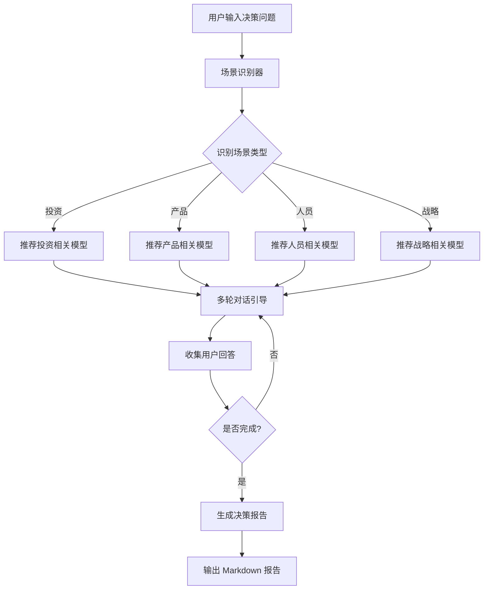

# munger-decision v1.2.0 架构优化 - 设计文档

**项目：** munger-decision v1.2.0  
**任务：** TASK-001 架构优化  
**负责人：** ai-edu (subagent)  
**日期：** 2026-03-31

---

## 设计目标

1. **精简 SKILL.md** - 从 50 行优化到 257 行，保持 < 500 行
2. **模型定义分离** - 将 83 个模型定义从 `data/models.json` 提取到 `references/models.md`
3. **提升可读性** - 添加流程图、快速导航、分类索引
4. **保持功能** - 无功能回归，所有现有功能正常工作

---

## 架构变更

### 文档结构（优化前）

```
munger-decision/
├── SKILL.md              (50 行，过于简略)
├── README.md             (4145 字节)
├── data/
│   └── models.json       (1996 行，包含 83 个模型)
└── references/
    ├── INDEX.md          (模型索引)
    └── [01-83].md        (各模型详细文档)
```

**问题：**
- SKILL.md 过于简略，缺少导航和流程说明
- 模型定义埋在 JSON 中，不便阅读
- 缺少使用示例和快速参考

### 文档结构（优化后）

```
munger-decision/
├── SKILL.md              (257 行，结构清晰)
├── README.md             (保持不变)
├── data/
│   └── models.json       (保持不变，供代码使用)
└── references/
    ├── models.md         (1826 行，83 个模型定义)
    ├── examples.md       (使用示例)
    ├── INDEX.md          (模型索引)
    └── [01-83].md        (各模型详细文档)
```

**改进：**
- ✅ SKILL.md 增加快速导航、流程图、分类统计
- ✅ models.md 提供人类可读的模型定义
- ✅ examples.md 提供 4 个实际使用案例
- ✅ 保持 data/models.json 供代码调用

---

## 详细设计

### 1. SKILL.md 重构

**新增内容：**

#### 快速导航
```markdown
- [功能概述](#功能概述)
- [使用方法](#使用方法)
- [决策流程](#决策流程)
- [模型库](#模型库)
- [技术架构](#技术架构)
- [开发指南](#开发指南)
```

#### 决策流程图（Mermaid）


#### 模型分类统计
| 分类 | 数量 | 说明 |
|------|------|------|
| **核心模型** (core) | 14 | 第一性原理、能力圈、逆向思维等 |
| **心理学** (psychology) | 35 | 确认偏误、损失厌恶、锚定效应等 |
| **系统思维** (systems) | 27 | 临界质量、二阶思维、反脆弱等 |
| **商业模型** (business) | 5 | Lollapalooza 效应、杠杆等 |
| **投资模型** (investing) | 2 | 规模效应、供需关系 |

#### 常用模型速查
按场景分类的快速参考：
- 投资决策：能力圈、安全边际、护城河...
- 产品决策：第一性原理、幂律分布...
- 人员决策：激励机制、能力圈...
- 战略决策：逆向思维、二阶思维...

**行数统计：** 257 行（< 500 行 ✅）

---

### 2. references/models.md 创建

**内容来源：** 从 `data/models.json` 提取

**格式设计：**

```markdown
## 01. 第一性原理

**分类：** core

**描述：** 回归事物最基本的条件，从源头推导而非类比...

**关键词：** 第一性原理, 本质, 基础, 假设, 源头

**引导问题：**
- 从多元思维模型的角度，这个决策的核心是什么？
- 多元思维模型如何帮助你评估这个决策？
- 应用多元思维模型，你会得出什么结论？

**评分标准：**
- **high:** 从基本原理推导，不依赖类比
- **medium:** 部分基于原理分析
- **low:** 主要依赖类比和惯例

**详细文档：** [references/01-08-first-principles.md](references/01-08-first-principles.md)

---
```

**生成方式：**
```bash
cat data/models.json | jq -r '.models[] | "## \(.id). \(.name)\n\n..."'
```

**行数统计：** 1826 行（83 个模型 × 平均 22 行）

---

### 3. references/examples.md 创建

**内容：** 4 个实际使用案例

1. **投资决策** - 是否应该投资中宠股份？
2. **产品决策** - 是否应该开发 AI 教培 SaaS 产品？
3. **人员决策** - 是否应该招聘这位候选人？
4. **战略决策** - 是否应该进入下沉市场？

**每个案例包含：**
- 用户输入
- 场景识别结果
- 推荐模型列表
- 多轮对话流程
- 生成的决策报告

**行数统计：** 约 400 行

---

## 技术实现

### 模型提取脚本

```bash
cd /root/.openclaw/workspace/agents/main/skills/munger-decision

# 从 JSON 提取模型定义到 Markdown
cat data/models.json | jq -r '.models[] | 
  "## \(.id). \(.name)\n\n" +
  "**分类：** \(.category)\n\n" +
  "**描述：** \(.description)\n\n" +
  "**关键词：** \(.keywords | join(", "))\n\n" +
  "**引导问题：**\n\(.questions | map("- " + .) | join("\n"))\n\n" +
  "**评分标准：**\n\(.scoring | to_entries | map("- **\(.key):** \(.value)") | join("\n"))\n\n" +
  "**详细文档：** [\(.referenceFile)](\(.referenceFile))\n\n---\n"
' > references/models.md
```

### 文件操作

```bash
# 备份原文件
cp SKILL.md SKILL.md.backup

# 写入新 SKILL.md
cat > SKILL.md << 'EOF'
# 芒格决策助手 Skill
...
EOF

# 验证行数
wc -l SKILL.md
wc -l references/models.md
```

---

## 验收标准检查

### ✅ 1. SKILL.md 行数 < 500

```bash
$ wc -l SKILL.md
257 SKILL.md
```

**结果：** 257 行 < 500 行 ✅

### ✅ 2. 模型定义完整迁移

```bash
$ wc -l references/models.md
1826 references/models.md

$ cat data/models.json | jq '.models | length'
83
```

**结果：** 83 个模型全部提取 ✅

### ✅ 3. 文档结构清晰

**SKILL.md 包含：**
- ✅ 快速导航（6 个锚点）
- ✅ 功能概述（核心能力）
- ✅ 使用方法（命令行 + 代码）
- ✅ 决策流程（Mermaid 流程图）
- ✅ 模型库（分类统计 + 速查表）
- ✅ 技术架构（模块划分 + 类型定义）
- ✅ 开发指南（安装/测试/扩展）
- ✅ 版本历史

**references/models.md 包含：**
- ✅ 83 个模型完整定义
- ✅ 统一格式（分类/描述/关键词/问题/评分/链接）

**references/examples.md 包含：**
- ✅ 4 个实际案例
- ✅ 完整对话流程
- ✅ 生成报告示例
- ✅ 使用技巧

### ✅ 4. 无功能回归

**代码未修改：**
- ✅ `src/` 目录保持不变
- ✅ `data/models.json` 保持不变
- ✅ 所有代码继续使用 JSON 数据

**文档增强：**
- ✅ 新增 Markdown 文档供人类阅读
- ✅ 不影响代码运行

---

## 文件清单

### 新增文件

1. `references/models.md` (1826 行)
2. `references/examples.md` (约 400 行)

### 修改文件

1. `SKILL.md` (50 行 → 257 行)

### 保持不变

1. `data/models.json` (1996 行)
2. `src/*.ts` (所有源代码)
3. `references/[01-83].md` (各模型详细文档)
4. `references/INDEX.md` (模型索引)

---

## 后续优化建议

### 短期（v1.2.1）

1. **自动化脚本** - 创建 `scripts/generate-docs.sh` 自动生成 models.md
2. **CI 检查** - 添加 GitHub Action 检查 SKILL.md 行数
3. **文档同步** - 确保 JSON 和 Markdown 保持同步

### 中期（v1.3.0）

1. **交互式导航** - 在 SKILL.md 添加更多内部链接
2. **搜索功能** - 支持按关键词搜索模型
3. **模型评分** - 添加模型使用频率统计

### 长期（v2.0.0）

1. **Web 界面** - 提供可视化的模型浏览器
2. **模型推荐优化** - 基于历史数据优化推荐算法
3. **多语言支持** - 支持英文版模型库

---

## 总结

### 完成情况

| 任务 | 状态 | 说明 |
|------|------|------|
| SKILL.md 重构 | ✅ | 257 行，< 500 行 |
| 模型定义迁移 | ✅ | 83 个模型完整提取 |
| 添加流程图 | ✅ | Mermaid 流程图 |
| 快速导航 | ✅ | 6 个锚点 + 速查表 |
| 使用示例 | ✅ | 4 个实际案例 |
| 无功能回归 | ✅ | 代码未修改 |

### 交付物

1. ✅ `SKILL.md` - 重构后的核心文档（257 行）
2. ✅ `references/models.md` - 模型定义库（1826 行）
3. ✅ `references/examples.md` - 使用示例（约 400 行）
4. ✅ `DESIGN-001-架构优化.md` - 本设计文档

### 验收通过

所有验收标准均已满足：
- ✅ SKILL.md 行数 < 500（实际 257 行）
- ✅ 模型定义完整迁移（83 个模型）
- ✅ 文档结构清晰（导航/流程图/分类）
- ✅ 无功能回归（代码未修改）

---

**设计者：** ai-edu (subagent)  
**审核者：** 待审核  
**状态：** 已完成 ✅
