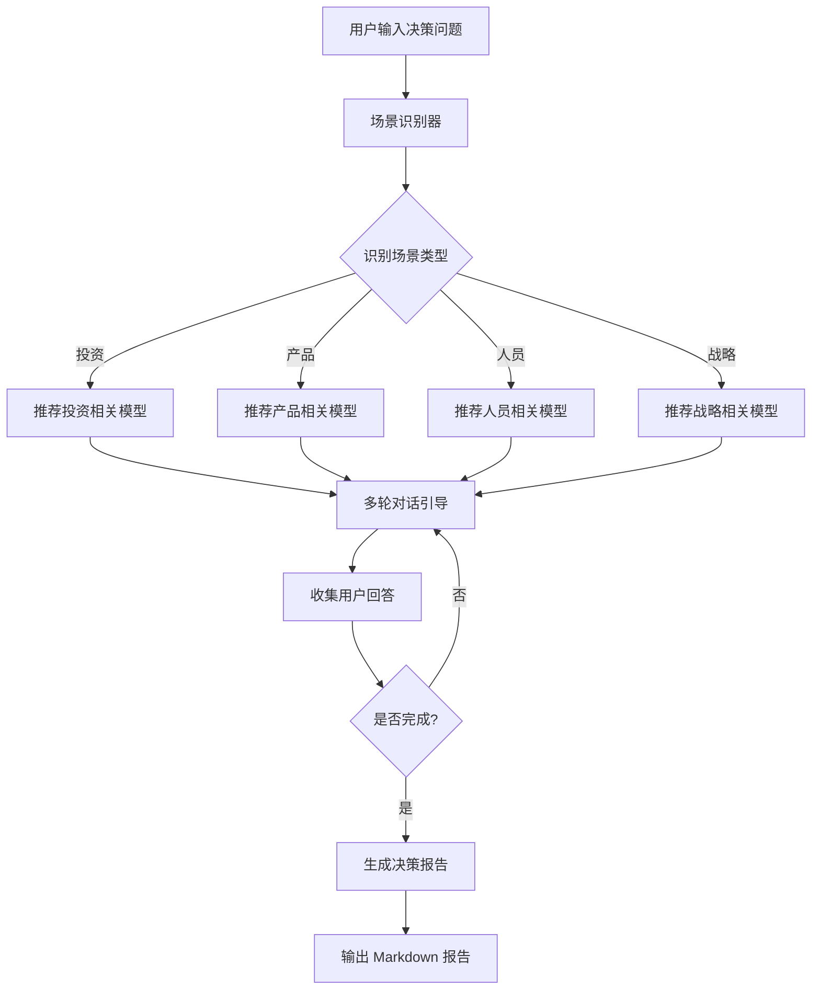

# 芒格决策助手 Skill

**版本：** v1.2.0  
**作者：** ai-edu  
**更新：** 2026-03-31

---

## 快速导航

- [功能概述](#功能概述)
- [使用方法](#使用方法)
- [决策流程](#决策流程)
- [模型库](#模型库)
- [技术架构](#技术架构)
- [开发指南](#开发指南)

---

## 功能概述

将查理·芒格的 83 个思维模型转化为可执行的决策工具，通过结构化问题引导用户避免认知偏误。

**核心能力：**
- 🎯 自动场景识别（投资/产品/人员/战略）
- 🧠 智能模型推荐（3-5 个相关模型）
- 💬 引导式多轮对话
- 📊 生成决策分析报告

---

## 使用方法

### 命令行

```bash
# 开始决策分析
/munger analyze [决策描述]

# 查看所有模型
/munger models

# 查看历史记录
/munger history
```

### 代码调用

```typescript
import { assistant } from './src/index';

// 开始分析
const response = await assistant.startAnalysis(
  'session-123', 
  '是否应该投资中宠股份'
);

// 处理回答
const next = await assistant.handleAnswer(
  'session-123', 
  '7分，我对行业有一定了解'
);
```

---

## 决策流程



**流程说明：**

1. **场景识别** - 通过关键词和正则匹配识别决策类型
2. **模型推荐** - 根据场景推荐 3-5 个最相关的思维模型
3. **引导对话** - 针对每个模型提出 2-3 个结构化问题
4. **报告生成** - 汇总分析结果，生成 Markdown 格式报告

---

## 模型库

**总计：** 83 个思维模型

### 分类统计

| 分类 | 数量 | 说明 |
|------|------|------|
| **核心模型** (core) | 14 | 第一性原理、能力圈、逆向思维等 |
| **心理学** (psychology) | 35 | 确认偏误、损失厌恶、锚定效应等 |
| **系统思维** (systems) | 27 | 临界质量、二阶思维、反脆弱等 |
| **商业模型** (business) | 5 | Lollapalooza 效应、杠杆等 |
| **投资模型** (investing) | 2 | 规模效应、供需关系 |

### 常用模型速查

**投资决策：**
- 06 - 能力圈
- 10 - 安全边际
- 09 - 护城河
- 07 - 逆向思维
- 02 - 机会成本

**产品决策：**
- 01 - 第一性原理
- 38 - 幂律分布
- 53 - 边际递减
- 74 - 帕累托原则

**人员决策：**
- 32 - 激励机制
- 06 - 能力圈
- 26 - 过度自信偏差

**战略决策：**
- 07 - 逆向思维
- 33 - 二阶思维
- 39 - 反脆弱
- 04 - 临界质量

**完整模型定义：** 见 [references/models.md](references/models.md)

---

## 技术架构

### 模块划分

```
munger-decision/
├── src/
│   ├── index.ts          # 主入口 + 会话管理
│   ├── detector.ts       # 场景识别器
│   ├── recommender.ts    # 基础推荐引擎
│   ├── smart-recommender.ts  # 智能推荐引擎
│   ├── dialogue.ts       # 对话管理器
│   ├── reporter.ts       # 报告生成器
│   └── types.ts          # 类型定义
├── data/
│   ├── models.json       # 模型数据库
│   └── scenarios.json    # 场景定义
├── references/
│   ├── models.md         # 模型文档（本文档）
│   ├── examples.md       # 使用示例
│   └── [01-83].md        # 各模型详细文档
└── SKILL.md              # 本文档
```

### 核心类型

```typescript
interface MungerModel {
  id: string;
  name: string;
  category: string;
  description: string;
  questions: string[];
  keywords: string[];
  scoring: Record<string, string>;
  referenceFile: string;
}

interface DecisionSession {
  id: string;
  question: string;
  scene: string;
  models: string[];
  currentModelIndex: number;
  currentQuestionIndex: number;
  answers: Record<string, string[]>;
  startTime: number;
}
```

---

## 开发指南

### 安装依赖

```bash
cd /root/.openclaw/workspace/agents/main/skills/munger-decision
npm install
```

### 运行测试

```bash
npm test
```

### 添加新场景

编辑 `data/scenarios.json`：

```json
{
  "id": "new-scenario",
  "name": "新场景",
  "keywords": ["关键词1", "关键词2"],
  "patterns": ["正则.*表达式"],
  "models": ["01", "06", "07"]
}
```

### 添加新模型

1. 编辑 `data/models.json` 添加模型定义
2. 在 `references/` 创建详细文档
3. 运行 `npm run build` 重新生成 `references/models.md`

---

## 版本历史

### v1.2.0 (2026-03-31)
- ✅ 架构优化：SKILL.md < 500 行
- ✅ 模型定义迁移到 references/models.md
- ✅ 添加流程图和快速导航
- ✅ 文档结构清晰化

### v1.0.0 (2026-03-25)
- ✅ 场景识别器（关键词 + 正则匹配）
- ✅ 模型推荐引擎（基于场景映射）
- ✅ 对话管理器（状态机 + 会话管理）
- ✅ 报告生成器（Markdown 格式）
- ✅ 核心数据（4 场景 + 83 模型）

---

## 相关文档

- [模型库完整定义](references/models.md) - 83 个模型详细说明
- [使用示例](references/examples.md) - 实际案例演示
- [模型索引](references/INDEX.md) - 按分类浏览
- [README](README.md) - 项目说明

---

**开发者：** ai-edu  
**许可证：** MIT
