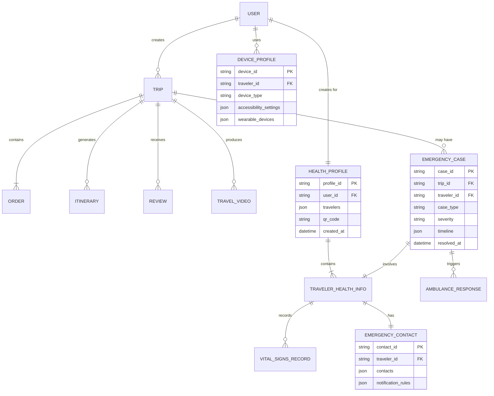

# 数据模型定义 v3.0（父母视角）

## 新增核心模型

v3.0 版本新增 4 大数据模型，专为老年人旅行安全保障设计：

1. **HealthProfile** - 健康档案
2. **EmergencyContact** - 紧急联系人
3. **DeviceProfile** - 设备信息
4. **EmergencyCase** - 紧急事件

---

## 1. HealthProfile（健康档案）⭐

**说明**：老年人的完整健康信息，包含病史、过敏史、用药记录等

```yaml
HealthProfile:
  type: object
  properties:
    profile_id:
      type: string
      description: 健康档案 ID
      example: "PROFILE20260401001"
      
    user_id:
      type: string
      description: 子女（下单人）用户 ID
      example: "2214118900513"
      
    travelers:
      type: array
      description: 出行人列表（父母）
      items:
        $ref: '#/TravelerHealthInfo'
        
    created_at:
      type: datetime
      example: "2026-04-01T10:00:00+08:00"
      
    updated_at:
      type: datetime
      example: "2026-04-01T10:00:00+08:00"
      
    qr_code:
      type: string
      description: 健康档案二维码（Base64）
      note: "急救人员可扫码快速获取健康信息"
      
    emergency_card_url:
      type: string
      description: 电子健康卡 URL
      example: "https://fliggy.com/health/card/xxx.pdf"

---

TravelerHealthInfo:
  type: object
  description: 单个出行人的健康信息
  
  properties:
    traveler_id:
      type: string
      description: 出行人 ID（与订单系统一致）
      
    basic_info:
      type: object
      properties:
        name: string
        age: integer
        gender: enum (male/female/other)
        id_no: string (脱敏存储)
        phone: string (脱敏存储)
        blood_type: enum (A/B/AB/O, 可选)
        height_cm: integer (可选)
        weight_kg: number (可选)
        
    chronic_conditions:
      type: array
      description: 慢性疾病史
      items:
        type: object
        properties:
          condition: string
          diagnosed_year: integer
          severity: enum (mild/moderate/severe)
          medications: array[string]
          dosage: string
          hospital: string (确诊医院)
          notes: string
      examples:
        - condition: "高血压"
          diagnosed_year: 2015
          severity: "moderate"
          medications: ["硝苯地平缓释片"]
          dosage: "每天 1 次，每次 1 片"
          hospital: "成都市第一人民医院"
          
    allergies:
      type: array
      description: 过敏史
      items:
        type: object
        properties:
          type: enum (drug/food/environmental/other)
          substance: string
          reaction: string
          severity: enum (mild/moderate/severe/anaphylaxis)
      examples:
        - type: "drug"
          substance: "青霉素"
          reaction: "皮疹、呼吸困难"
          severity: "anaphylaxis"
          
    surgical_history:
      type: array
      description: 手术史
      items:
        type: object
        properties:
          procedure: string
          year: integer
          hospital: string
          outcome: string
          
    regular_medications:
      type: array
      description: 长期服用药物
      items:
        type: object
        properties:
          name: string
          dosage: string
          purpose: string
          start_date: date
          end_date: date (可选)
          reminders:
            type: array
            items: string (如"早餐后", "睡前")
            
    vital_signs_history:
      type: array
      description: 生命体征历史记录
      items:
        $ref: '#/VitalSignsRecord'
        
    emergency_contact:
      $ref: '#/EmergencyContact'
      
    preferred_hospital:
      $ref: '#/PreferredHospital'
      
    health_insurance:
      type: object
      description: 健康保险信息
      properties:
        insurer: string
        policy_number: string
        coverage_amount: number
        valid_until: date
        emergency_hotline: string
```

---

## 2. EmergencyContact（紧急联系人）

**说明**：父母的紧急联系人信息，支持多人多级联系

```yaml
EmergencyContact:
  type: object
  
  properties:
    contact_id:
      type: string
      
    traveler_id:
      type: string
      
    contacts:
      type: array
      description: 联系人列表（按优先级排序）
      items:
        type: object
        properties:
          name: string
          relation: string (如"女儿", "儿子", "配偶")
          phone: string
          priority: integer (1=最高优先级)
          available_24h: boolean
          preferred_contact_method: enum (phone_call/sms/dingtalk/wechat)
          language: string (如"普通话", "四川话")
          backup_contacts:
            type: array
            items: string (备用联系方式)
            
    notification_rules:
      type: object
      description: 通知规则
      properties:
        notify_all_for_critical: boolean (危急情况通知所有人)
        max_notify_attempts: integer (最大通知次数)
        retry_interval_seconds: integer (重试间隔)
        escalation_timeout_minutes: integer (升级超时)
        
    examples:
      contacts:
        - name: "张女士"
          relation: "女儿"
          phone: "139****1234"
          priority: 1
          available_24h: true
          preferred_contact_method: "phone_call"
          language: "普通话"
          
        - name: "李先生"
          relation: "儿子"
          phone: "138****5678"
          priority: 2
          available_24h: false
          preferred_contact_method: "dingtalk"
          language: "普通话"
          
        - name: "地接社紧急热线"
          relation: "服务商"
          phone: "0871-8888888"
          priority: 3
          available_24h: true
          preferred_contact_method: "phone_call"
```

---

## 3. DeviceProfile（设备信息）

**说明**：父母使用的设备信息，用于优化交互体验

```yaml
DeviceProfile:
  type: object
  
  properties:
    device_id:
      type: string
      
    traveler_id:
      type: string
      
    device_type: enum (smartphone/tablet/smartwatch/feature_phone)
    
    os:
      type: object
      properties:
        platform: enum (iOS/Android/HarmonyOS/other)
        version: string
        
    app_versions:
      type: object
      properties:
        fliggy_app: string
        dingtalk_app: string
        wechat_app: string
        
    accessibility_settings:
      type: object
      description: 无障碍设置
      properties:
        font_size: integer (默认 18，范围 14-32)
        high_contrast: boolean
        voice_assistant_enabled: boolean
        hearing_impaired_mode: boolean
        vision_impaired_mode: boolean
        
    notification_preferences:
      type: object
      properties:
        enable_voice_calls: boolean
        enable_push_notifications: boolean
        enable_sms_backup: boolean
        quiet_hours:
          type: object
          properties:
            start: string (如"21:00")
            end: string (如"07:00")
            
    wearable_devices:
      type: array
      description: 可穿戴设备（智能手表等）
      items:
        type: object
        properties:
          device_name: string
          brand: string
          model: string
          features: array[string] (如["heart_rate", "blood_oxygen", "fall_detection"])
          sync_enabled: boolean
          last_sync_time: datetime
          
    network_environment:
      type: object
      properties:
        carrier: string (如"中国移动")
        signal_quality: enum (excellent/good/fair/poor)
        roaming_status: boolean
        wifi_available: boolean
        
    examples:
      device_type: "smartphone"
      os:
        platform: "iOS"
        version: "16.5"
      accessibility_settings:
        font_size: 24
        high_contrast: true
        voice_assistant_enabled: true
      notification_preferences:
        enable_voice_calls: true
        enable_push_notifications: true
        enable_sms_backup: true
        quiet_hours:
          start: "21:00"
          end: "07:00"
      wearable_devices:
        - device_name: "Apple Watch Series 8"
          brand: "Apple"
          features: ["heart_rate", "blood_oxygen", "ecg", "fall_detection"]
          sync_enabled: true
```

---

## 4. EmergencyCase（紧急事件）

**说明**：记录所有紧急救助事件的处理过程

```yaml
EmergencyCase:
  type: object
  
  properties:
    case_id:
      type: string
      example: "EMG20260401001"
      
    trip_id:
      type: string
      
    traveler_id:
      type: string
      
    case_type: enum (medical/accident/lost/fraud/other)
    
    severity: enum (mild/moderate/critical)
    
    status: enum (open/in_progress/resolved/closed)
    
    timeline:
      type: array
      description: 事件处理时间轴
      items:
        type: object
        properties:
          timestamp: datetime
          action: string
          actor: enum (ai/system/guide/child/ambulance/hospital)
          details: object
          result: string
          
    location:
      type: object
      properties:
        latitude: number
        longitude: number
        address: string
        poi: string
        accuracy_meters: number
        
    symptoms_or_issue:
      type: array
      items: string
      examples: ["chest_pain", "shortness_of_breath", "dizziness"]
      
    actions_taken:
      type: array
      description: 已采取的行动
      items:
        type: object
        properties:
          action_type: enum (call_ambulance/dispatch_guide/notify_child/send_alert/provide_instructions)
          target: string
          time: datetime
          status: enum (pending/in_progress/completed/failed)
          result: object
          
    medical_response:
      type: object
      description: 医疗响应信息
      properties:
        ambulance_called: boolean
        ambulance_no: string
        eta_minutes: integer
        hospital_info:
          type: object
          properties:
            name: string
            address: string
            distance_km: number
            emergency_phone: string
        diagnosis: string
        treatment: string
        admission_status: enum (outpatient/emergency_admission/icu/observation)
        
    contacts_notified:
      type: array
      items:
        type: object
        properties:
          name: string
          relation: string
          phone: string
          notification_method: enum (phone_call/sms/dingtalk/wechat)
          notified_at: datetime
          response: enum (answered/unanswered/callback_later)
          
    insurance_claim:
      type: object
      properties:
        claim_number: string
        insurer_notified: boolean
        estimated_coverage: number
        required_documents: array[string]
        claim_status: enum (pending/submitted/approved/rejected)
        
    resolution:
      type: object
      properties:
        resolved_at: datetime
        resolution_summary: string
        traveler_status: enum (recovered/hospitalized/transferred/deceased)
        follow_up_required: boolean
        follow_up_scheduled: datetime
        
    lessons_learned:
      type: array
      description: 经验总结（用于改进服务）
      items: string
      
    examples:
      case_id: "EMG20260401001"
      case_type: "medical"
      severity: "critical"
      status: "closed"
      timeline:
        - timestamp: "2026-04-11T10:30:00+08:00"
          action: "health_report_received"
          actor: "ai"
          details: {"heart_rate": 120, "blood_pressure": {"systolic": 180}}
        - timestamp: "2026-04-11T10:30:30+08:00"
          action: "severity_assessed"
          actor: "ai"
          details: {"level": "critical"}
        - timestamp: "2026-04-11T10:31:00+08:00"
          action: "ambulance_called"
          actor: "system"
          details: {"ambulance_no": "云 L·120345"}
      actions_taken:
        - action_type: "call_ambulance"
          status: "completed"
          result: {"eta_minutes": 8}
        - action_type: "notify_child"
          status: "completed"
          result: {"daughter_called": true}
      medical_response:
        ambulance_called: true
        hospital_info:
          name: "大理市第一人民医院"
          distance_km: 2.5
      contacts_notified:
        - name: "张女士"
          relation: "女儿"
          notification_method: "phone_call"
          response: "answered"
      resolution:
        resolved_at: "2026-04-11T12:00:00+08:00"
        resolution_summary: "送医及时，病情稳定，已出院返回酒店休息"
        traveler_status: "recovered"
```

---

## 5. VitalSignsRecord（生命体征记录）

**说明**：单次生命体征测量记录

```yaml
VitalSignsRecord:
  type: object
  
  properties:
    record_id:
      type: string
      
    traveler_id:
      type: string
      
    timestamp:
      type: datetime
      
    source:
      type: enum (smart_watch/manual_input/medical_device)
      
    measurements:
      type: object
      properties:
        heart_rate:
          type: integer
          unit: "bpm"
          normal_range: "60-100"
          
        blood_pressure:
          type: object
          properties:
            systolic: integer (收缩压)
            diastolic: integer (舒张压)
          unit: "mmHg"
          normal_range: "<120/80"
          
        blood_sugar:
          type: number
          unit: "mmol/L"
          normal_range: "3.9-6.1 (空腹)"
          
        body_temperature:
          type: number
          unit: "℃"
          normal_range: "36.0-37.2"
          
        oxygen_saturation:
          type: integer
          unit: "%"
          normal_range: "95-100"
          
    symptoms:
      type: array
      items: string
      
    self_assessment:
      type: string
      
    risk_assessment:
      type: object
      properties:
        level: enum (normal/mild/moderate/critical)
        recommendations: array[string]
        alert_triggered: boolean
```

---

## ER 关系图（更新版）



---

## 数据字典

### 慢性病类型标准代码

| 代码 | 名称 | 说明 |
|-----|------|------|
| HTN | 高血压 | Hypertension |
| T2DM | 2 型糖尿病 | Type 2 Diabetes Mellitus |
| CHD | 冠心病 | Coronary Heart Disease |
| ASTHMA | 哮喘 | Asthma |
| COPD | 慢阻肺 | Chronic Obstructive Pulmonary Disease |
| ARTHRITIS | 关节炎 | Arthritis |
| OSTEOPOROSIS | 骨质疏松 | Osteoporosis |

### 过敏原分类代码

| 代码 | 类型 | 常见物质 |
|-----|------|---------|
| DRUG | 药物过敏 | 青霉素、头孢、阿司匹林等 |
| FOOD | 食物过敏 | 海鲜、坚果、芒果等 |
| ENV | 环境过敏 | 花粉、尘螨、宠物毛发等 |
| INSECT | 昆虫过敏 | 蜜蜂、黄蜂蜇伤等 |

### 紧急程度分级标准

| 级别 | 英文 | 判定标准 | 处置流程 |
|-----|------|---------|---------|
| 轻微 | mild | 生命体征正常或轻微异常，自述不适但不影响行动 | AI 安抚 + 建议休息 + 通知导游陪同 |
| 中等 | moderate | 生命体征异常（超出正常值 20-50%），持续不适 | 安排送医 + 通知子女 + 调整行程 |
| 严重 | critical | 生命体征危急（超出正常值 50% 以上），意识模糊，无法回应 | 自动拨打 120 + 联动多方 + 启动保险 |

---

**文档维护者**: 汪小玲 (苏英)  
**所属部门**: 飞猪 -CTO 线 - 技术质量 - 服务质量  
**创建日期**: 2026-04-01  
**版本**: v3.0（父母视角重构）