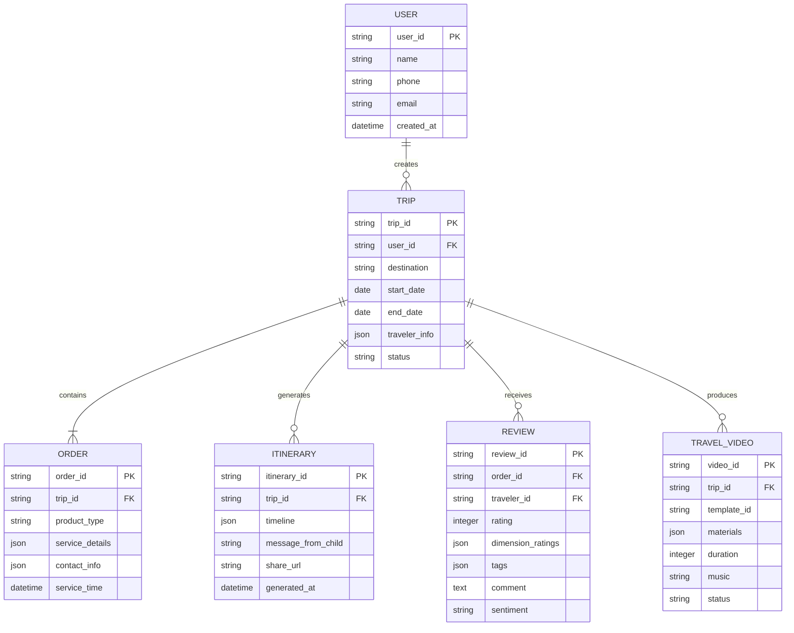

# 数据模型定义

## ER 关系图



---

## 核心数据模型

### 1. User（用户）

**说明**：子女（下单人）基本信息

```yaml
User:
  type: object
  properties:
    user_id:
      type: string
      description: 用户 ID（淘宝/飞猪用户 ID）
      example: "2214118900513"
    
    name:
      type: string
      description: 真实姓名
      example: "张女士"
    
    phone:
      type: string
      description: 手机号码（脱敏存储）
      example: "139****1234"
    
    email:
      type: string
      description: 邮箱地址
      example: "zhang***@example.com"
    
    dingtalk_userid:
      type: string
      description: 钉钉用户 ID
      example: "DINGTALK001"
    
    preferences:
      type: object
      description: 用户偏好设置
      properties:
        notification_channel:
          type: string
          enum: [dingtalk, sms, both]
          default: dingtalk
        
        music_preference:
          type: string
          enum: [classic, folk, pop, instrumental]
          default: classic
        
        video_style:
          type: string
          enum: [warm, dynamic, documentary]
          default: warm
    
    created_at:
      type: datetime
      description: 创建时间
    
    updated_at:
      type: datetime
      description: 更新时间
```

---

### 2. Traveler（出行人）

**说明**：父母（实际出行人）信息

```yaml
Traveler:
  type: object
  properties:
    traveler_id:
      type: string
      description: 出行人 ID
      example: "TRAVELER001"
    
    trip_id:
      type: string
      description: 关联旅程 ID
      example: "TRIP20260401001"
    
    name:
      type: string
      description: 真实姓名
      example: "张父"
    
    age:
      type: integer
      description: 年龄
      example: 65
    
    gender:
      type: string
      enum: [male, female]
      example: male
    
    id_type:
      type: string
      enum: [身份证，护照，港澳台通行证]
      example: 身份证
    
    id_no:
      type: string
      description: 证件号（加密存储）
      example: "510***********1234"
    
    phone:
      type: string
      description: 手机号码
      example: "138****5678"
    
    relation_to_user:
      type: string
      description: 与下单人关系
      example: 父女
    
    special_needs:
      type: array
      description: 特殊需求
      items:
        type: string
      example: ["行动缓慢", "高血压", "素食"]
    
    health_conditions:
      type: array
      description: 健康状况备注
      items:
        type: string
      example: ["需定时服药", "不宜剧烈运动"]
```

---

### 3. Trip（旅程）

**说明**：一次完整的旅行记录

```yaml
Trip:
  type: object
  properties:
    trip_id:
      type: string
      description: 旅程 ID
      example: "TRIP20260401001"
    
    user_id:
      type: string
      description: 下单人 ID
      example: "2214118900513"
    
    title:
      type: string
      description: 旅程标题
      example: "云南六天五晚自由行"
    
    destination:
      type: string
      description: 目的地
      example: "云南"
    
    cities:
      type: array
      description: 途经城市
      items:
        type: string
      example: ["昆明", "大理", "丽江", "香格里拉"]
    
    start_date:
      type: date
      example: "2026-04-10"
    
    end_date:
      type: date
      example: "2026-04-15"
    
    days:
      type: integer
      description: 行程天数
      example: 6
    
    travelers:
      type: array
      description: 出行人列表
      items:
        $ref: "#/definitions/Traveler"
    
    status:
      type: string
      enum: [pending, traveling, completed, cancelled]
      example: pending
    
    order_count:
      type: integer
      description: 关联订单数
      example: 5
    
    budget:
      type: number
      description: 总预算（元）
      example: 15000.00
    
    actual_cost:
      type: number
      description: 实际花费（元）
      example: 14280.00
    
    created_at:
      type: datetime
    
    updated_at:
      type: datetime
```

---

### 4. Order（订单）

**说明**：旅行相关的产品订单

```yaml
Order:
  type: object
  properties:
    order_id:
      type: string
      description: 订单 ID
      example: "ORDER123456"
    
    trip_id:
      type: string
      description: 关联旅程 ID
      example: "TRIP20260401001"
    
    user_id:
      type: string
      description: 下单人 ID
      example: "2214118900513"
    
    product_type:
      type: string
      enum: [flight, hotel, tour, transfer, photo, insurance]
      example: flight
    
    product_name:
      type: string
      description: 商品名称
      example: "北京 - 昆明 往返机票"
    
    status:
      type: string
      enum: [pending, paid, confirmed, in_service, completed, cancelled, refunded]
      example: paid
    
    amount:
      type: integer
      description: 订单金额（分）
      example: 258000
    
    service_time:
      type: datetime
      description: 服务时间
      example: "2026-04-10T10:30:00+08:00"
    
    service_details:
      type: object
      description: 服务详情（根据产品类型不同而不同）
      
      # 机票示例
      example_for_flight:
        flight_no: CA1234
        departure:
          airport: PEK
          terminal: T3
          city: 北京
          time: "2026-04-10T10:30:00+08:00"
        arrival:
          airport: KMG
          terminal: T1
          city: 昆明
          time: "2026-04-10T13:45:00+08:00"
        passengers:
          - name: 张父
            id_type: 身份证
            id_no: 510***********1234
            seat: 35A
          - name: 李母
            id_type: 身份证
            id_no: 510***********5678
            seat: 35B
        cabin_class: economy
        baggage_allowance: 20kg
      
      # 酒店示例
      example_for_hotel:
        hotel_name: 昆明翠湖宾馆
        address: 昆明市五华区翠湖南路 XX 号
        check_in: "2026-04-10"
        check_out: "2026-04-12"
        nights: 2
        room_type: 豪华双床房
        guests:
          - 张父
          - 李母
        breakfast_included: true
        cancellation_policy: free_cancellation_before_24h
      
      # 当地游示例
      example_for_tour:
        tour_name: 大理古城一日游
        guide_name: 王导
        guide_phone: 138****5678
        meeting_point: 酒店大堂
        meeting_time: "08:30"
        itinerary:
          - time: "08:30-11:00"
            activity: 大理古城游览
          - time: "11:00-12:30"
            activity: 白族特色餐
          - time: "13:30-16:00"
            activity: 崇圣寺三塔
        included: ["门票", "午餐", "导游服务"]
        excluded: ["个人消费"]
      
      # 接送机示例
      example_for_transfer:
        type: airport_drop_off  # airport_pickup / airport_drop_off
        driver_name: 王师傅
        driver_phone: 138****5678
        car_plate: 京 A·XXXXX
        car_model: 别克 GL8
        pickup_location: 北京市朝阳区 XX 小区北门
        pickup_time: "2026-04-10T08:00:00+08:00"
        dropoff_location: 北京首都机场 T3 航站楼
        flight_no: CA1234
        passenger_count: 2
        luggage_count: 3
        special_requirements: 老人行动不便，需协助搬运行李
    
    contact_info:
      type: object
      description: 联系人信息
      properties:
        merchant_name:
          type: string
          example: 中国国际航空
        
        merchant_phone:
          type: string
          example: 95583
        
        emergency_contact:
          type: string
          example: 平台客服 400-xxx-xxxx
    
    created_at:
      type: datetime
    
    updated_at:
      type: datetime
```

---

### 5. Itinerary（行程单）

**说明**：生成的电子行程单

```yaml
Itinerary:
  type: object
  properties:
    itinerary_id:
      type: string
      example: "ITINERARY20260401001"
    
    trip_id:
      type: string
      example: "TRIP20260401001"
    
    version:
      type: integer
      description: 版本号（每次修改 +1）
      example: 1
    
    cover:
      type: object
      properties:
        title:
          type: string
          example: "云南六天五晚自由行"
        
        subtitle:
          type: string
          example: "给最爱的爸爸妈妈"
        
        date_range:
          type: string
          example: "2026-04-10 ~ 2026-04-15"
        
        traveler_names:
          type: array
          items:
            type: string
          example: ["张父", "李母"]
        
        background_image:
          type: string
          example: "https://img.fliggy.com/cover/xxx.jpg"
    
    message_from_child:
      type: object
      properties:
        text:
          type: string
          example: "亲爱的爸爸妈妈，这次旅行虽然我不能陪在身边..."
        
        voice_url:
          type: string
          example: "https://oss.fliggy.com/voice/xxx.mp3"
        
        voice_duration:
          type: integer
          description: 语音时长（秒）
          example: 45
        
        photo_url:
          type: string
          example: "https://img.fliggy.com/family/xxx.jpg"
    
    timeline:
      type: array
      description: 行程时间轴
      items:
        type: object
        properties:
          day:
            type: integer
            example: 1
          
          date:
            type: date
            example: "2026-04-10"
          
          title:
            type: string
            example: "出发日"
          
          weather:
            type: object
            properties:
              condition:
                type: string
                example: 晴
              temp_high:
                type: integer
                example: 23
              temp_low:
                type: integer
                example: 15
          
          activities:
            type: array
            items:
              type: object
              properties:
                time:
                  type: string
                  example: "08:00"
                
                type:
                  type: string
                  enum: [transfer, flight, hotel_checkin, tour, meal, free_time]
                  example: transfer
                
                content:
                  type: string
                  example: "司机李师傅上门接"
                
                location:
                  type: object
                  properties:
                    name:
                      type: string
                      example: "北京市朝阳区 XX 小区北门"
                    
                    lat:
                      type: number
                      example: 39.9042
                    
                    lng:
                      type: number
                      example: 116.4074
                
                contact:
                  type: object
                  properties:
                    name:
                      type: string
                      example: "李师傅"
                    
                    phone:
                      type: string
                      example: "138****5678"
                
                action_buttons:
                  type: array
                  items:
                    type: string
                    enum: [call, navigate, view_detail]
                  example: ["一键拨号", "地图导航"]
                
                tips:
                  type: string
                  example: "建议提前 10 分钟下楼等候"
    
    emergency_contacts:
      type: array
      items:
        type: object
        properties:
          role:
            type: string
            example: 子女
          
          name:
            type: string
            example: 张女士
          
          phone:
            type: string
            example: "139****1234"
    
    authorization:
      type: object
      properties:
        letter_id:
          type: string
          example: "AUTH20260401001"
        
        letter_url:
          type: string
          example: "https://fliggy.com/auth/letter/xxx"
        
        qr_code:
          type: string
          description: Base64 编码的二维码图片
          example: "data:image/png;base64,..."
        
        validity_period:
          type: object
          properties:
            start:
              type: date
              example: "2026-04-10"
            
            end:
              type: date
              example: "2026-04-15"
    
    share_settings:
      type: object
      properties:
        h5_url:
          type: string
          example: "https://fliggy.com/itinerary/h5/xxx"
        
        qr_code_url:
          type: string
          example: "https://img.fliggy.com/qrcode/xxx.png"
        
        long_image_url:
          type: string
          example: "https://img.fliggy.com/longimg/xxx.jpg"
        
        pdf_url:
          type: string
          example: "https://fliggy.com/itinerary/pdf/xxx.pdf"
        
        enable_wechat:
          type: boolean
          example: true
        
        enable_dingtalk:
          type: boolean
          example: true
    
    generated_at:
      type: datetime
    
    updated_at:
      type: datetime
```

---

### 6. Review（评价）

**说明**：服务评价记录

```yaml
Review:
  type: object
  properties:
    review_id:
      type: string
      example: "REVIEW20260401001"
    
    order_id:
      type: string
      example: "ORDER123456"
    
    trip_id:
      type: string
      example: "TRIP20260401001"
    
    traveler_id:
      type: string
      description: 评价人（出行人）ID
      example: "TRAVELER001"
    
    service_type:
      type: string
      enum: [transfer, hotel, tour, photo]
      example: transfer
    
    rating:
      type: integer
      minimum: 1
      maximum: 5
      example: 5
    
    dimension_ratings:
      type: object
      description: 维度评分（根据服务类型动态调整）
      
      example_for_transfer:
        punctuality: 5
        attitude: 5
        driving: 5
        cleanliness: 5
      
      example_for_hotel:
        cleanliness: 5
        service: 4
        facilities: 5
        location: 5
      
      example_for_tour:
        guide_professionalism: 4
        itinerary_arrangement: 5
        meal_quality: 4
        safety: 5
    
    tags:
      type: array
      items:
        type: string
      example: ["准时", "态度好", "驾驶平稳", "车辆干净"]
    
    comment:
      type: string
      description: 文字评价
      example: "司机师傅很准时，提前 10 分钟就到了，车也很干净，开得很稳"
    
    media:
      type: array
      items:
        type: object
        properties:
          type:
            type: string
            enum: [image, video]
            example: image
          
          url:
            type: string
            example: "https://img.fliggy.com/review/xxx.jpg"
          
          description:
            type: string
            example: "车内环境整洁"
    
    sentiment:
      type: string
      enum: [positive, neutral, negative]
      example: positive
    
    sentiment_score:
      type: number
      minimum: 0
      maximum: 1
      example: 0.92
    
    status:
      type: string
      enum: [published, pending_review, under_review, hidden]
      example: published
    
    credit_delta:
      type: integer
      description: 服务商信用分变化
      example: 5
    
    created_at:
      type: datetime
    
    updated_at:
      type: datetime
```

---

### 7. TravelVideo（旅行视频）

**说明**：AI 生成的旅行纪念视频

```yaml
TravelVideo:
  type: object
  properties:
    video_id:
      type: string
      example: "VIDEO20260401001"
    
    trip_id:
      type: string
      example: "TRIP20260401001"
    
    title:
      type: string
      example: "云南·六天五晚自由行"
    
    template_id:
      type: string
      example: "warm_family_version"
    
    template_name:
      type: string
      example: "温馨亲情版"
    
    duration:
      type: integer
      description: 视频时长（秒）
      example: 195
    
    resolution:
      type: string
      example: "1080p"
    
    materials:
      type: object
      properties:
        photos_used:
          type: integer
          example: 73
        
        videos_used:
          type: integer
          example: 5
        
        total_materials:
          type: integer
          example: 78
        
        material_ids:
          type: array
          items:
            type: string
          example: ["PHOTO001", "PHOTO002"]
    
    music:
      type: object
      properties:
        music_id:
          type: string
          example: "MUSIC001"
        
        title:
          type: string
          example: "月光下的凤尾竹"
        
        artist:
          type: string
          example: "葫芦丝演奏"
    
    filters:
      type: array
      items:
        type: string
      example: ["warm_memory", "natural_beauty"]
    
    status:
      type: string
      enum: [pending, processing, completed, failed, published]
      example: completed
    
    video_url:
      type: string
      example: "https://video.fliggy.com/result/xxx.mp4"
    
    cover_url:
      type: string
      example: "https://img.fliggy.com/cover/xxx.jpg"
    
    file_size:
      type: integer
      description: 文件大小（字节）
      example: 52428800
    
    share_urls:
      type: object
      properties:
        wechat:
          type: string
          example: "https://fliggy.com/share/wechat/xxx"
        
        douyin:
          type: string
          example: "https://fliggy.com/share/douyin/xxx"
        
        dingtalk:
          type: string
          example: "https://fliggy.com/share/dingtalk/xxx"
    
    footprint_map_url:
      type: string
      description: 旅行足迹地图 URL
      example: "https://fliggy.com/map/footprint/xxx"
    
    statistics:
      type: object
      properties:
        views:
          type: integer
          example: 128
        
        likes:
          type: integer
          example: 45
        
        shares:
          type: integer
          example: 12
    
    created_at:
      type: datetime
    
    published_at:
      type: datetime
```

---

## 数据库表设计（MySQL 示例）

### trips 表

```sql
CREATE TABLE trips (
    trip_id VARCHAR(32) PRIMARY KEY,
    user_id VARCHAR(32) NOT NULL,
    title VARCHAR(255) NOT NULL,
    destination VARCHAR(100) NOT NULL,
    cities JSON,
    start_date DATE NOT NULL,
    end_date DATE NOT NULL,
    days INT NOT NULL,
    traveler_info JSON,
    status ENUM('pending', 'traveling', 'completed', 'cancelled') DEFAULT 'pending',
    budget DECIMAL(10,2),
    actual_cost DECIMAL(10,2),
    created_at DATETIME DEFAULT CURRENT_TIMESTAMP,
    updated_at DATETIME DEFAULT CURRENT_TIMESTAMP ON UPDATE CURRENT_TIMESTAMP,
    
    INDEX idx_user_id (user_id),
    INDEX idx_status (status),
    INDEX idx_dates (start_date, end_date)
) ENGINE=InnoDB DEFAULT CHARSET=utf8mb4;
```

### orders 表

```sql
CREATE TABLE orders (
    order_id VARCHAR(32) PRIMARY KEY,
    trip_id VARCHAR(32) NOT NULL,
    user_id VARCHAR(32) NOT NULL,
    product_type ENUM('flight', 'hotel', 'tour', 'transfer', 'photo', 'insurance') NOT NULL,
    product_name VARCHAR(255) NOT NULL,
    status ENUM('pending', 'paid', 'confirmed', 'in_service', 'completed', 'cancelled', 'refunded') DEFAULT 'pending',
    amount BIGINT NOT NULL COMMENT '金额（分）',
    service_time DATETIME,
    service_details JSON,
    contact_info JSON,
    created_at DATETIME DEFAULT CURRENT_TIMESTAMP,
    updated_at DATETIME DEFAULT CURRENT_TIMESTAMP ON UPDATE CURRENT_TIMESTAMP,
    
    INDEX idx_trip_id (trip_id),
    INDEX idx_user_id (user_id),
    INDEX idx_product_type (product_type),
    INDEX idx_service_time (service_time)
) ENGINE=InnoDB DEFAULT CHARSET=utf8mb4;
```

### reviews 表

```sql
CREATE TABLE reviews (
    review_id VARCHAR(32) PRIMARY KEY,
    order_id VARCHAR(32) NOT NULL,
    trip_id VARCHAR(32) NOT NULL,
    traveler_id VARCHAR(32) NOT NULL,
    service_type ENUM('transfer', 'hotel', 'tour', 'photo') NOT NULL,
    rating TINYINT NOT NULL CHECK (rating BETWEEN 1 AND 5),
    dimension_ratings JSON,
    tags JSON,
    comment TEXT,
    media JSON,
    sentiment ENUM('positive', 'neutral', 'negative'),
    sentiment_score DECIMAL(3,2),
    status ENUM('published', 'pending_review', 'under_review', 'hidden') DEFAULT 'published',
    credit_delta INT DEFAULT 0,
    created_at DATETIME DEFAULT CURRENT_TIMESTAMP,
    updated_at DATETIME DEFAULT CURRENT_TIMESTAMP ON UPDATE CURRENT_TIMESTAMP,
    
    INDEX idx_order_id (order_id),
    INDEX idx_trip_id (trip_id),
    INDEX idx_rating (rating),
    INDEX idx_sentiment (sentiment)
) ENGINE=InnoDB DEFAULT CHARSET=utf8mb4;
```

---

**文档维护者**: 汪小玲 (苏英)  
**最后更新**: 2026-04-01
